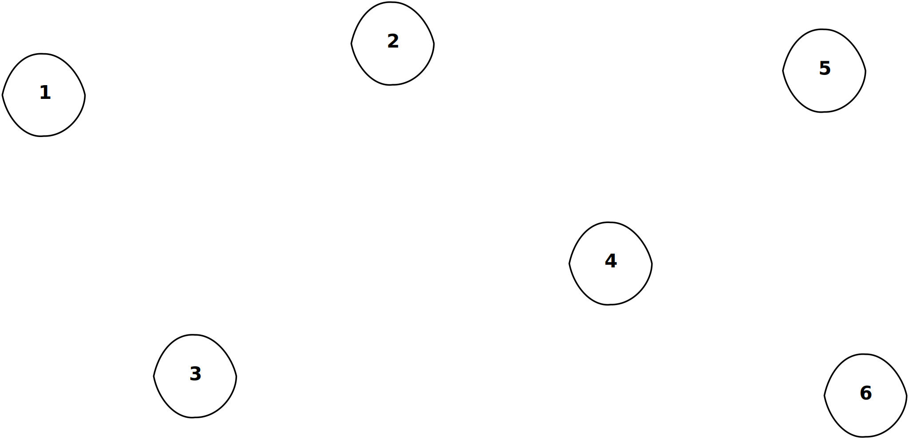
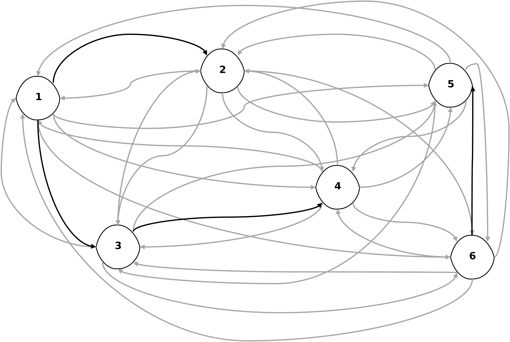
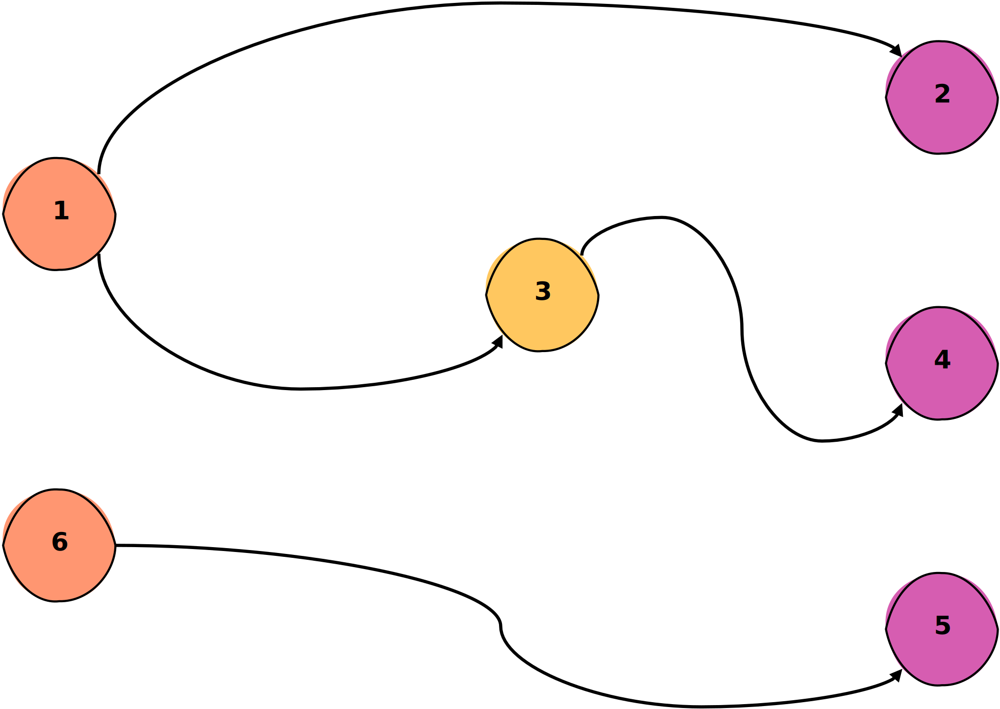

# Creo's Architecture and Design

This documents describes the architecture and design of Creo in detail.
It covers the generation process step by step starting from generating an application graph
to outputting the source code of applications.

## Representing Microservice Application as Directed Graphs

Creo represents the topology of a microservice application as a directed, acyclic graph (DAG).
In order to generate an application, we construct a random DAG based on the user-provided configuration.
Consider the following `topology` section of a **AutoPilot** generation configuration:

```yaml
topology:
  services: 3
  endpoints: 6
  inter_service_calls: 4
```

According to this configuration, the generated application should comprise 3 microservices with a total number of 6
endpoints. That is, the average number of endpoints per service is $\frac{6}{3} = 2$. In total, there should exist 4
inter-service calls between any two endpoints.
Generating a DAG that adheres to this specification involves 4 steps:

### Step 1: Graph Vertices

Creo's application model constructs microservice applications as a bottom-up approach.
That is, we start by first generating the endpoints, then adding the inter-service calls between endpoints, and finally
aggregating endpoints into microservices. In our model, we represent the endpoints of the microservice application as
graph vertices. That is, in our example we first add 6 vertices to our DAG, since the number of endpoints is 6.

<div align="center">
  
  <p>Figure 1: Generated graph vertices</p>
</div>

### Step 2: Graph Edges

Next, we need to generate the graph edges. In our model, graph edges relate to the interactions between to endpoints.
That is, a directed edge from vertex $v$ to a vertex $u$ defines a inter-service call from endpoint $v$ to endpoint $u$.
In our example, we require 4 inter-service calls, thus we need to generate 4 directed graph edges. We achieve this,
by drawing the desired number of edges from the set of all possible edges. In our example, there are $6 \cdot 5 = 30$
possible edges, since each of the 6 endpoints may have an outgoing edge to one of the other 5 vertices.

<div align="center">
  
  <p>Figure 2: Generated graph edges</p>
</div>

In Figure 2, the gray edges represent all possible edges, while the black edges correspond to the actual generated
edges. As can be seen in the figure, when a request reaches endpoint 1, it will call endpoint 2 and endpoint 3 before
returning a response. In turn, endpoint 3 will also call endpoint 4 on receiving the request from endpoint 1 and will
return its response to endpoint 1 after receiving a response from endpoint 4. With this, we model the dependency
structure of endpoints typically found in microservice applications. Similarly, endpoint 6 calls endpoint 5 before
responding to its incoming network requests.
In the following, we will only depict the generated edges, such that the figures stay well organized.

### Step 3: Graph Coloring

At the moment, the endpoints in our application are only related via their network call dependencies.
However, the relation to microservices is still missing. In this step, we will color the graph to group endpoints into
microservices. Vertices (i.e., endpoints) that have the same color will belong to the same microservice.
We ensure that the found coloring of the graph is proper, that is if two vertices $v$ and $u$ are connected by a edge
they will not have the same color. If we would allow connected vertices to also have the same color, then a endpoint
would send a network request to another endpoint of the same microservice. Even though this is rarely used in practice,
it is generally considered an anti-pattern when designing and developing microservice systems.
In our case, we want to generate 3 services according to the provided topology configuration. Thus, we color the graph
using 3 colors.

<div align="center">
  
  <p>Figure 3: The colored graph</p>
</div>

Figure 3 depicts a possible coloring for our application graph. We also rearranged the vertices into layers to better
illustrate the inter-service calls among the endpoints of the application's microservices. In our example, the orange
microservice has two endpoints, i.e. endpoint 1 and endpoint 6. The yellow microservice comprises the single endpoint 3,
while the magenta microservice has the most endpoints, i.e. endpoint 2, endpoint 4, and endpoint 5. With the colored
graph, we generated a full representation of the microservice application topology. However, the application workload
is still missing from this representation. Hence, we will assign the workload in the next step.

## Assigning the Application Workload to the Graph

Lets consider the following service types configuration:

```yaml
service_types:
  # CPU-intensive microservice (s1)
  - fraction: 50
    properties:
      - label: CPU
        fraction: 100
        bucket: HIGH
  # Outgoing network-intensive microservice (s2)
  - fraction: 50
    properties:
      - label: NETWORK_TRANSMIT
        fraction: 100
        bucket: HIGH
```

The configuration consists of two service types. The first service type - let's call it $s1$ - represents a
highly CPU-intensive microservice, while the second service type ($s2$) represents a highly network-intensive
microservice in terms of outgoing network traffic. In other words, for our application we expect each of the three
microservices to be either a highly CPU-intensive or a highly outgoing network-intensive microservice. As per the
configuration, the probability of each service type is $50\\%$. To select the service types for each of our three
microserives, we repeat the following procedure for every service:

### Step 1: Select a Programming Language

First, we select a programming language for a particular service. This ensures that we select handler functions
implemented in the same programming language for each of the service's endpoints. For instance, we might start by
selecting `Python` for the yellow microservice.

### Step 2: Select a Service Types

Second, we select a particular service type for the microservice. The `fraction` values of each service type determine
the probability to select the corresponding service type. As such, the single `fraction` values in the `service_type`
list must add up to `100`. In our example configuration from above, the two service types in the list have an equal
chance of `50` percent. Let's assume that we select the CPU-intensive service type for the yellow microservice.

### Step 3: Select Handler Functions for Endpoints

Now that we selected both the service type and programming language for the microservice, we are able to select the
specific handler function for each endpoint of the microservice. In our example, we know that for the yellow microservice
we must select CPU-intensive handler functions implemented in `Python`. Thus, we first gather all `Python` handler
functions. According to the configuration, `100` percent of endpoints for the yellow microservice should exhibit a high
CPU usage. We describe the procedure for more complex configurations later. In our simple case, we order the
gathered `Python` handler functions according to their CPU labels.

<div align="center" >

| Handler Function | CPU-Label |
| :--------------- | :-------: |
| matrix           |  1469.83  |
| hash             |  118.99   |
| register         |  112.83   |
| invoice_update   |   21.04   |
| user_delete      |   17.18   |
| invoice_delete   |   16.96   |

<p>Table 1: Handler function ordering by CPU label </p>
</div>

In our example, we consider that we have gathered six `Python` handler functions, namely `matrix`, `hash`, `register`,
`invoice_update`, `user_delete`, and `invoice_delete`. Table 1 shows the descending ordering of the handler functions
according to their CPU labels. We can split this ordering into three buckets to distribute the functions into `LOW`,
`MEDIUM`, and `HIGH` intensities. In our case, the `HIGH` bucket comprises `matrix` and `hash`, the `MEDIUM` bucket
contains `register` and `invoice_update`, while the `LOW` bucket includes `user_delete` and `invoice_delete`.
As per the service type configuration, we are interested in functions in the `HIGH` bucket. That is, in our example, we
uniformly choose a function from the `HIGH` bucket at random for each yellow microservice's endpoints. Note that we
sample with replacement, i.e., each endpoint's function is chosen independently from the other endpoints.

For simplicity, our example configuration only contains one entry in the `properties` lists of the two service types.
In the case, a service type specifies multiple `properties` entries, we require one additional step before ordering the
handler functions. Let's consider the following service type configuration:

```yaml
service_types:
  - fraction: 100
    properties:
      - label: CPU
        fraction: 34
        bucket: HIGH
      - label: CPU
        fraction: 33
        bucket: MEDIUM
      - label: MEMORY
        fraction: 33
        bucket: LOW
```

When we assign the handler functions to the endpoints of microservice of that service type, we first determine the
`properties` list entry that we consider for the current endpoint. That is, in this case, the proability for `CPU-HIGH`
is `34%`, the proability for `CPU-MEDIUM` is `33%`, and the proability for `MEMORY-LOW` is also `33%`. Suppose, this
configuration applies to the orange microservice. We might choose the `MEMORY-LOW` entry for the first endpoint
resulting in an ordering by MEMORY label. For the second endpoint, we might select the `CPU-MEDIUM` entry, thus ordering
the handler functions by CPU label.

Repeating this 3-step process for all microservices and their endpoints, assigns one handler function to each endpoint
in the graph.
